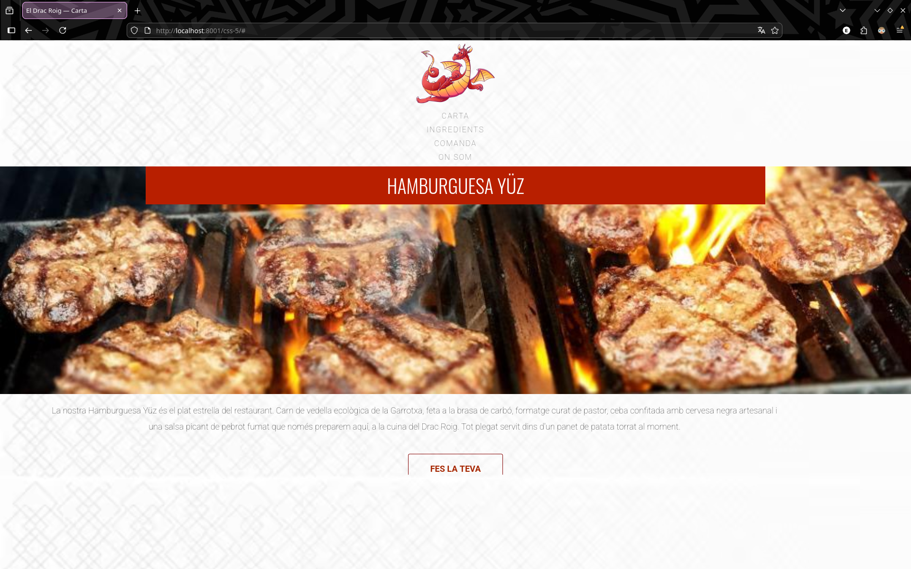

### Documentació CSS
https://developer.mozilla.org/en-US/docs/Web/CSS

# Exercici 1 - Estil de CSS

Crea una fulla d'estils CSS coherent amb els següents punts:

a) Crea el fitxer **style.css** i enllaça'l a l'HTML.  
b) Selecciona el **header** i assigna-li el color `rgb(64, 193, 247)` mitjançant la propietat `background-color`.  
c) Centra el text del **header** amb la propietat `text-align`.  
d) Selecciona el paràgraf introductori de Laia (`.about-me`) i assigna-li una mida de lletra de **20px** amb `font-size`.  
e) Redueix l’opacitat del paràgraf `.about-me` al **50%**.  
f) Selecciona els elements amb classe **title** i afegeix-los la propietat `font-weight: bold` per mostrar-los en negreta.  
g) Assigna al **header** principal el color **Azure** perquè contrasti millor amb el fons.  
h) Canvia la font de tota la pàgina assignant a `body` la propietat `font-family: Georgia`.  
i) Al mateix `body`, assigna un fons **tileable** amb aquesta imatge:  
https://img.freepik.com/free-vector/geometric-pattern-background-vector-white_53876-128361.jpg

*Resultat exercici 1*

# Exercici 2 - Sistema box-model
Modifica la fulla d'estils existent i soluciona els problemes de posició i espaiat.

a) Observa que l'element `<nav>` conté el logo del restaurant (un drac) i 4 títols d'apartats.  
- Assigna un `width` de **180px** a la imatge.  
- Centra la imatge fent ús del `margin`.

b) Assigna als `` dins d’un `<nav>` un marge superior i inferior de **10px** i un marge esquerra i dreta de **0px**.

c) Assigna als elements de la classe `.content` una altura (`height`) de **500px**, un marge vertical de **10px** i un marge horitzontal **automàtic**.

d) Centra l’element `<main>` dins de `.content` assignant-li **0 marge vertical** i **marge horitzontal automàtic**.

e) Fes `.content` *scrollable* amb la propietat `overflow`.  
   Comprova que funciona correctament redimensionant la finestra del navegador.

f) Respecte a la capçalera **"HAMBURGUESA YÜZ"**:  
- Assigna una altura de **480px** a `<header>`.  
- Assigna **20px de padding** a l’element `<h1>` que conté `<header>`.  
- Centra l’element `<h1>` mitjançant **0 marge vertical** i **marge horitzontal automàtic**.

g) Respecte al botó **"FAIG UNA COMANDA"**:  
- Assigna una amplada de **200px**.  
- Assigna un `padding` de **20px**.  
- Assigna un marge vertical de **40px** i un marge horitzontal **automàtic**.  
- Assigna al botó un `border` d’**1px**, `solid`, i de **color blau**.

h) Respecte a la informació nutricional:  
- Assigna un `padding` de **20px** a la llista (classe `.nutrition`).  
- Assigna una amplada de **200px** a cada element `<li>`.  
- Assigna un `padding` vertical de **10px** i horitzontal de **20px** a cada `<li>`.  
- Afegeix **3px de marge inferior** a cada `<li>`.

*Resultat exercici 2*