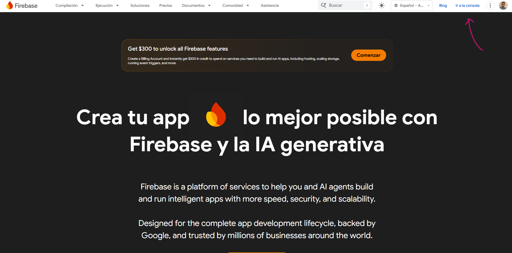
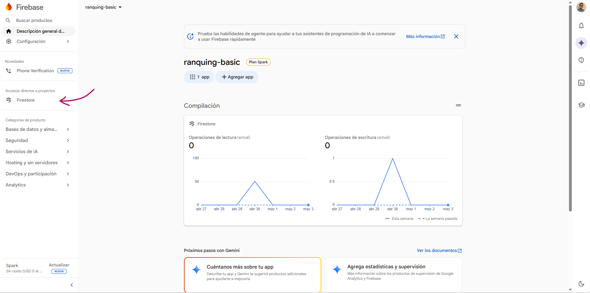
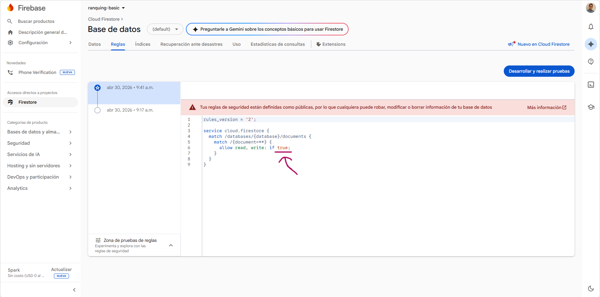
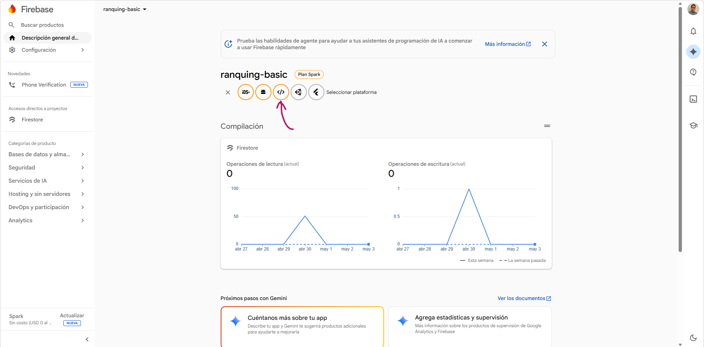
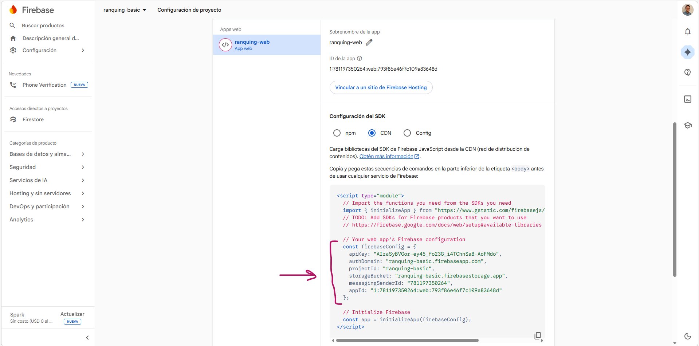

1. Anar a la consola i crear un projecte

2. Afegir categoria Firestore i crear base de dades

3. Configurar regles d'accés

4. Afegir aplicació web a la descripció general del projecte

5. Connectar projecte Firebase amb aplicació web (codi javascript)

